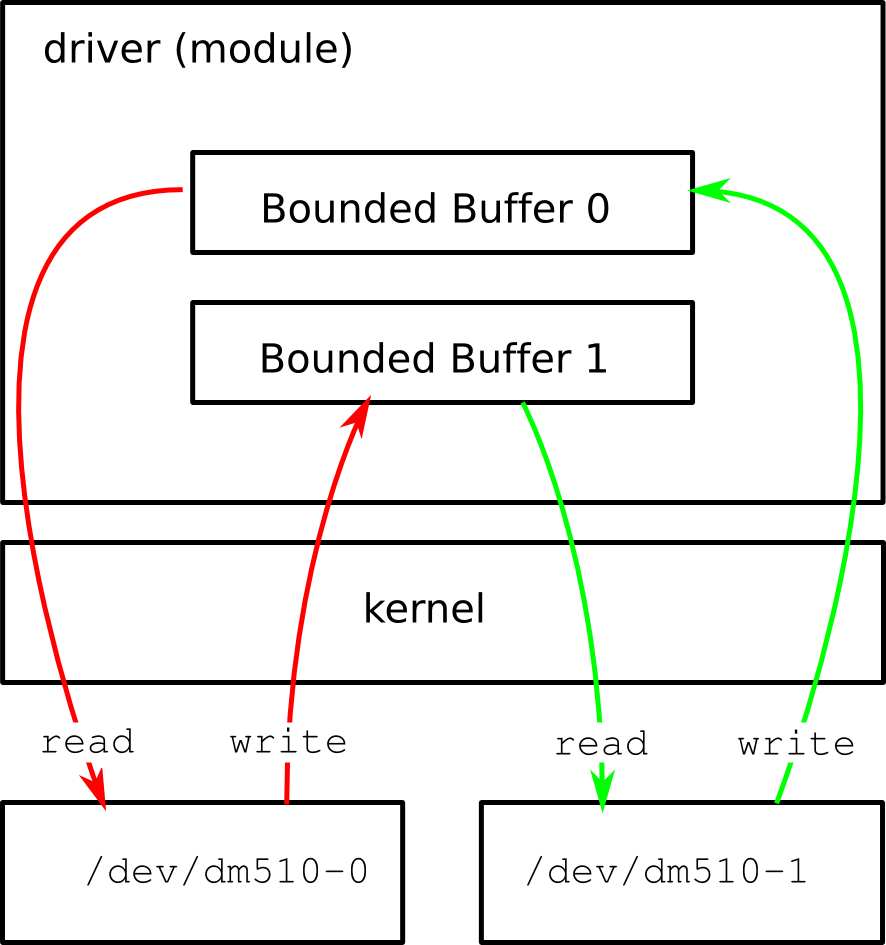

# Project 2: Kernel Module

## Introduction
In this assignment, your task is to make a kernel module. This module must implement a driver that exposes two character devices to user-space. Their function will be explained below.

To complete this task it will be necessary to study the following sources:

Chapters 2, 3, 5 (especially for semaphores) and 6 (especially for blocking and non-blocking I/O and for device control with `ioctl`) in the online book [Linux Device Drivers (LDD)](https://lwn.net/Kernel/LDD3/), 3rd edition (for 2.6 kernels) hold all the information you need to complete this assignment. The original source code of all examples from LDD can be found [here](https://resources.oreilly.com/examples/9780596005900/). At the time of writing LDD, the Linux kernel 2.6.10 was used. An updated version of all files that should work with more recent kernels can be found [here](https://github.com/duxing2007/ldd3-examples-3.x).

The example code from LDD for the scull driver that you have to study for this assignment was updated to work with kernel 6.6.9, therefore this is a good starting point (for more details which updates have been made see FAQ - the main changes in comparison to the version as presented in the book are related to handling of credentials). You can also use The Linux Kernel Module Programming Guide ([pdf](http://www.tldp.org/LDP/lkmpg/2.6/lkmpg.pdf), [html](http://www.tldp.org/LDP/lkmpg/2.6/html/lkmpg.html)) as a source of information.

**The files that you can use as a starting point for you kernel module can be found [here](assignment2.zip). The most relevant LDD book example source is found [here](scull.zip)**

## The Driver
Normally a device driver sits between some hardware and the kernel I/O subsystem. Its purpose is to give the kernel a consistent interface to the type of hardware it "drives". This way the kernel can communicate with all hardware of a given type through the same interface, even though the actual hardware differs.

In this assignment we will not interface to hardware because of the complexity this would impose. Instead, we will make two processes communicate through a device driver.

The figure below illustrates how the driver should work. Basically it solves the producer-consumer problem. Here the two processes can be both producers and consumers. This resembles the functionality of a real hardware device driver, where both the hardware and the kernel can produce and consume data.

When a process writes (produces) to character device `/dev/dm510-0` the data is stored in bounded buffer 1. If the buffer is full the process has to wait until another process has read from `/dev/dm510-1`.

When a process reads (consumes) from character device /dev/dm510-0 the data is read from bounded buffer 0. If the buffer is empty the process has to wait until another process has written to `/dev/dm510-1`.

Writes and reads to and from `/dev/dm510-1` are handled in the same way.

In the code from LDD there is an example `scull/pipe.c` which does almost the same (chapter 6 of LDD). The difference is that only one character device has been used (one minor). This means that the data you write to it can be read back from the same device.

## Requirements
The requirements are:

* Your module has to be made for kernel 6.6.9
* You should either use a major number of 255 and minor numbers of 0 and 1 or automatically assigned major/minor numbers (see Chapter 3 of LDD).
* Blocking and/ Non-blocking I/O must be supported (see Chapter 6 of LDD, page 147ff).
* Several processes at a time must be able to open each device for reading, only one process at the time should be able to open a device for writing.
* Simple device control has to be possible via the `ioctl` system call. Implement
    * adjusting the buffer sizes and
    * setting the maximal number of processes that are allowed to read the device at a time via ioctl (see Chapter 6 of LDD, page 135ff or Chapter 7 of The Linux Kernel Module Programming Guide).
* A simple blocking mechanism has to be implemented (see Chapter 6 of LDD, page 147ff). You could for example consider to put processes to sleep using simple sleeping (see the LDD book), if too many processes want to read from the buffer. Then you could use ioctl to wake these processes up. However, this is just a suggestion, any reasonable simple mechanism where sleeping is used is fine.
* The device should support multiple processes executing simultaneously in the device driver at the same time. As this could lead to race conditions and other problems, you should use semaphores (or other synchronisation methods) to avoid potential problems.

This is **not** required:
* Backward compatibility. Not needed, the module does only have to be compatible with kernel 6.6.9.
* udev and devfs support.
* Poll, select and asynchronous notification support (see Chapter 6 of LDD).

## Attacking the Problem

Before you can work with kernel modules you have to execute the following command once only in the root directory of the linux kernel you used for assignment 1, in order to make sure certain dependencies are fulfilled:

make ARCH=um modules

After that, the hardest part of most kernel programming is to understand the environment that your code should run in. Therefore, most of your time should be spent studying how character devices work. This will minimize the testing and debugging phase. Recommended is to start with reading the first chapters of LDD.

### Compiling and inserting a simple module

Create a working directory for your project as a subdirectory of the directory dm510, that you created for installing UML. Fetch the files that are the starting point for your implementation ( dm510_dev.c, Makefile, dm510_load, dm510_unload), store them in the working directory, change into the working directory containing these files and edit Makefile if necessary. (You may have to change the KERNELDIR variable with the path to your UML kernel, if you are using a non-standard location).

If you have downloaded both the scull example and the starting point files, you should have a structure of files similar to this:


dm510
├── assignment2
│   ├── dm510_dev.c
│   ├── dm510_load
│   ├── dm510_unload
│   ├── Makefile
│   └── moduletest.c
├── linux-6.6.9
│   ├── arch
│   ├── ... (Several items omitted)
│   └── vmlinux.symvers
└── scull
    ├── access.c
    ├── main.c
    ├── Makefile
    ├── pipe.c
    ├── scull.h
    ├── scull.init
    ├── scull_load
    ├── sculltest.c
    └── scull_unload

Now you can compile the module by running `make` from the assignment2 directory. If the compilation succeeds there will now be a file called `dm510_dev.ko` which is the module. Start the UML kernel. Create the necessary devices and insert the module by executing

./dm510_load

To remove the module and to delete the devices execute:


./dm510_unload

See LDD chapter 4 and check the two scripts for details. Similar for the scull example. For the scull example, you can compile the test program using `gcc sculltest.c`.

### Making the Driver
The file `dm510_dev.c` is the code for the simple module above. It has almost empty declarations of all the functions that you need to modify in order to complete this assignment. These are:

int dm510_init_module(void);

void dm510_cleanup_module(void);

int dm510_open(struct inode *, struct file *);

int dm510_release(struct inode *, struct file *);

ssize_t dm510_read(struct file *, char *, size_t, loff_t *);

ssize_t dm510_write(struct file *, const char *, size_t, loff_t *);

long dm510_ioctl(struct file*filp, unsigned int cmd, unsigned long arg);


To get an idea of how to implement these functions you should study the implementation of the scull device driver, especially the pipelined version of the driver. This driver is explained in detail in LDD, especially pages 153ff. Study this example thoroughly, especially `pipe.c`.

## Changes to the LDD original versions
Kernel changes made it necessary to change the scull driver code and the templates for this assignment (compared to the original LDD versions). What follows are questions/changes based on these changes:
* If you try to compile the examples from the LDD book and you get errors like error: struct task_struct has no member named uid, the following is the reason: Recent kernels use a different handling of **credentials**. The important fact for this assignment is that accessing credentials is now done via wrappers (for example uid_t current_uid(void) for the current’s real UID). This used to be accessible via fields in the structure task_struct. The scull driver and especially the file access.c have been adapted.
* `init_MUTEX` is deprecated, however due to the simple macro that was used `(#define init_MUTEX(_m) sema_init(_m,1))` this is easy to fix and was done in the scull driver.
* The ioctl ops in struct file_operations is deprecated since kernel version 2.6.36. It needs to be converted to unlocked_ioctl ops. This was done for the scull driver. See for example [here](http://tuxthink.blogspot.dk/2012/12/implementing-ioctl-call-for-kernel.html). This also infuenced the declaration of dm510_ioctl in the templates given for this assignment compared to previous years assignments.
* In 2012 there was the start of distinguishing between internal kernel uids and gids (details see [here](https://lwn.net/Articles/491310/)) and values that userspace can use. This was done by introducing two new types: `kuid_t` and `kgid_t`. These types and their associated functions are declared in the new header *uidgid.h*. For the scull driver we needed to map uids, e.g., `current->cred->uid` was changed to `__kuid_val(current->cred->uid)` (and similar). This was modified in *access.c*.
