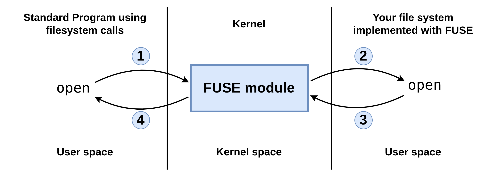

# Project 3: File System

## Introduction
The goal for this assignment is to create a file system using FUSE, a tool that allows us to run file system code as a regular program (a.k.a. in userspace). When a FUSE program is run, it creates a file system at a mount point provided by the user, and then makes its virtual file system appear within that mount point. All operations performed within the subdirectories and files within that mount point are passed, by the kernel, onto the FUSE program to handle.

### FUSE
FUSE (Filesystem in USErspace) is an easy way to create a file system running in userspace for Linux. It is a software interface for Unix and Unix-like computer operating systems that lets non-privileged users create their own file systems without editing kernel code.

There are many difficulties in writing a file system, two of the biggest are:

1. A large, complex API
2. File system lives in kernel space (hard to debug, easy to crash the machine)

FUSE fixes #1 by providing a simpler, more uniform API. For example, in FUSE all operations take a full, absolute path (a path is absolute if it starts with "/"). There is no notion of relative paths. FUSE fixes #2 by running your file system code in user space rather than in kernel space. The architecture of FUSE is found in the figure below.



- A program, such as ls or mkdir makes a call to a file system routine. For example, open("/test/fuse/file1.txt"). This call gets sent to the kernel.
- If this file is in a FUSE volume, the kernel passes it on to the FUSE kernel module, which then passes it on to the implementation of that file system (this is the portion you are to implement in this project).
- The implementation of open then refers to the actual data structures that represent the file system and returns a file handle. It is open’s job to take a concrete view of data (bits stored on a hard drive) and present an abstract view (a hierarchically organized file system).
- The kernel returns the result of the open function to the program that originally made the call.

### FUSE API



Also, there is a `getattr` function, which applies to both files and directories. `getattr` returns various statistics, such as file size, or the number of files in a directory. This is heavily used, and should be one of the first places to implement.

You can find more information about the data structures of FUSE in the file **/usr/include/fuse/fuse_common.h** and the interface of the functions in **/usr/include/fuse/fuse.h**. The latest version of fuse.h have some usefull documentation as well: [fuse.h](https://github.com/libfuse/libfuse/blob/master/include/fuse.h). But keep in mind it is a newer version than installed at IMADA.

### Taking FUSE for a test run

Download the files dm510fs.c and Makefile, and create an executable with the name dm510fs. The following sample session shows how this very simple sample file system is mounted (via the command dm510fs) and unmounted (via the command fusermount -u).

```
$ mkdir ~/dm510fs-mountpoint
$ chmod 755 ~/dm510fs-mountpoint/
$ ./dm510fs ~/dm510fs-mountpoint/
$ cd ~/dm510fs-mountpoint/
~/dm510fs-mountpoint$ ls
hello
~/dm510fs-mountpoint$ cd ..
$ fusermount -u ~/dm510fs-mountpoint/
```

You should use the sample file system as a base for your implementation of your filesystem.

If you see the code of `dm510fs.c` you see several printf statements, that in the previous session was not shown in the terminal session (and not found in any of the logs under `/var/log/`). To see these, use the `-f` flag (i.e. `./dm510fs -f ~/dm510fs-mountpoint/`), which keeps FUSE in the foreground. You then need another terminal to interact with your filesystem.

## The Task and Requirements

The filesystem you will implement is simplified and makes many shortcuts, compared to a real usable filesystem.

RAM is not as expensive as it once was, we here assume it is so cheap that the entire contents of hard drives is kept in main memory such that only writes requires actually transferring data to the hard drive; after the initial read of the contents of the hard drive, everything else is done using only main memory.

In this project, you will make a filesystem that exists primarily in memory, except for when it is mounted and unmounted (then it is read/written to a file on disk).

### The inode

The first you should do is to consider what your inode should contain. You are allowed to restrict the length of the filesystem path and the name of the file, and can keep this in an array of a fixed length. The same goes for the data of the files, where you can restrict the max length of a file to what can be in a fixed length array in the inode.

With these limitations, your inode can have a fixed size, and you can consider your filesystem as an array of inodes, with both data and metadata of the directories and files.

### Requirements for Functionality

Your file system should implement the following parts of a file system using appropriate APIs from FUSE.

- **Directories:** List, create, and delete files. Create and delete directories. You can omit rename and link. You are as mentioned above allowed to restrict the length of filenames.
- **Files:** Open, close. Sequential read/write of streams of bytes.
- **Inodes:** Size, access and modification time stamps. You can omit owner, permissions, reference count, etc.
- **Persistance:** Once the filesystem is mounted, you should restore a previous version (if one exists), and unmounting should save to disk.

Remember to document your choises in the report.

### Code Requirements
All of your functions should be named with a prefix that is closely related to your filesystem name. For this project use dm510fs.

The actual file system should be implemented using a normal semi-large (5mb) file in the file system of the computer you use, i.e. if your filesystem writes to the harddisk, this semi-huge file in the file system is changed. Everything must of course be able to run on the Linux machines at IMADA. You should read into memory the full file when the filesystem is mounted, and write out when unmounted. You could periodically write in between, but this is not a requirement.

Note that in the description above, a lot of details are left out. You have to decide for yourself what is appropriate and what to do, and document the choises in your report.

## Getting Started
One way to get started is to define the inode, and create the array of inodes. The try to migrate the small demo functionality to use your inodes. When this works, you are in a good spot to continue implementing directories and later files.

It is acceptable to just loop throug the array of inodes to locate the inode(s) you need for the function you are implementing. Helper functions could be of great use (fx. functions to extract the name and the path of an argument).

## Fuse Gotchas
There are several common problems that plague programmers new to Fuse. This is a partial list:

- **Error: Transport endpoint not connected**: You need to do the fusermount even if your program crashes or you abort it. Otherwise you’ll get a confusing "Transport endpoint not connected" message the next time you try to mount the test system.
- **Multithreading**: By default, Fuse is multithreaded. That’s handy for production filesystems, because it lets client (or file access) A proceed even if client B is hung up. But multithreading introduces the possibility of race conditions, and makes debugging harder. You can run FUSE with the -s switch to avoid this problem.
- **getattr**: Fuse calls getattr like crazy. Implement it first, or nothing will work.
- **Truncate**: Unless you’re writing a read-only filesystem, you need to implement the truncate system call to make writes work correctly.
- **Working directory**: When it starts, Fuse changes its working directory to "/". That will probably break any code that uses relative pathnames. To make matters worse, the `chdir` is suppressed when you run with the `-f` switch, so your code might appear to work fine under the debugger. To avoid the problem, either (a) use absolute pathnames, or (b) record your current working directory by calling `get_current_dir_name` before you invoke `fuse_main`, and then convert relative pathnames into corresponding absolute ones. Obviously, (b) is the preferred approach.
- **Printf**: Your printf/fprintf debugging code will only work if you run with the `-f` switch. Otherwise, Fuse disconnects stdout and stderr.
- **Unimplemented functions**: It is very tempting to just leave functions undefined if your filesystem doesn’t need them, or if you just haven’t gotten around to writing them yet. Don’t. If a function isn’t listed in your fuse_operations struct, Fuse will silently generate a failure when it is called, and you’ll never find out that you need to write it. Instead, write every unimplemented function as a stub that prints a message to stderr and returns an error code. When you see the message, you’ll know what extra functions you need to write.
