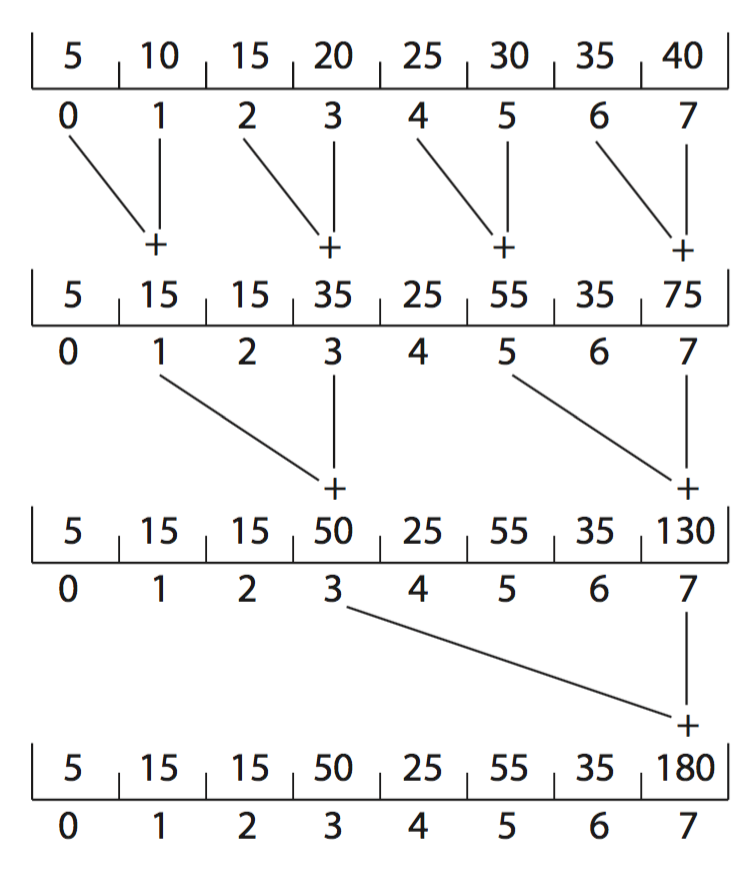

# Exercise Sheet for Tutorial 4

**Before** the tutorial session, try your best to solve problems below and be prepared to discuss them at the tutorial session.

### Related to Chapter 6
1. Disabling interrupts frequently can affect the system’s clock. Explain why this can occur and how such effects can be minimized.
2. What is the meaning of the term busy waiting? What other kinds of waiting are there in an operating system? Can busy waiting be avoided altogether? Explain your answer.
3. Explain why spinlocks are not appropriate for single-processor systems yet are often used in multiprocessor systems.
4. Show that, if the `wait()` and `signal()` semaphore operations are not executed atomically, then mutual exclusion may be violated.
5. Illustrate how a binary semaphore can be used to implement mutual exclusion among n processes.
6. Race conditions are possible in many computer systems. Consider a banking system that maintains an account balance with two functions: `deposit(amount)` and `withdraw(amount)`. These two functions are passed the amount that is to be deposited or withdrawn from the bank account balance. Assume that a husband and wife share a bank account. Concurrently, the husband calls the `withdraw()` function, and the wife calls `deposit()`. Describe how a race condition is possible and what might be done to prevent the race condition from occurring.
7. The pseudocode below illustrates the basic push() and pop() operations of an array-based stack. Assuming that this algorithm could be used in a concurrent environment, answer the following questions:
    - What data have a race condition?
    - How could the race condition be fixed?
    ```
    push(item) {
         acquire();
         if (top < SIZE) {
             stack[top] = item;
             top++;
         }
         else
             ERROR
         release();
     }
     pop() {
         acquire();
         if (!is empty()) {
             top--;
             item = stack[top];
             release();
             return item;
         }
         else
             ERROR
         release();
     }
     is_empty() {
         if (top == 0)
             return true;
         else
             return false;
     }
    ```
8. The following program example can be used to sum the array values of size N elements in parallel on a system containing N computing cores (there is a separate processor for each array element):
    ```
     for j = 1 to log 2(N) {
         for k = 1 to N {
             if ((k + 1) % pow(2,j) == 0) {
               values[k] += values[k - pow(2,(j-1))]
             }
         }
     }
    ```
    This has the effect of summing the elements in the array as a series of partial sums, as shown in the figure below.

    

    After the code has executed, the sum of all elements in the array is stored in the last array location. Are there any race conditions in the above code example? If so, identify where they occur and illustrate with an example. If not, demonstrate why this algorithm is free from race conditions.
8. One approach for using `compare_and_swap()` for implementing a spinlock is as follows:
    ```
     void lock spinlock(int *lock) {
         while (compare_and_swap(lock, 0, 1) != 0)
             ; /* spin */
     }
    ```
    A suggested alternative approach is to use the "compare and compare-and-swap" idiom, which checks the status of the lock before invoking the `compare_and_swap()` operation. (The rationale behind this approach is to invoke `compare_and_swap()` only if the lock is currently available.)

    This strategy is shown below:
    ```
     void lock_spinlock(int *lock) {
         while (true) {
             if (*lock == 0) {
                 /* lock appears to be available */

                 if (!compare_and_swap(lock, 0, 1))
                     break;
             }
         }
     }
    ```
    Does this "compare and compare-and-swap" idiom work appropriately for implementing spinlocks? If so, explain. If not, illustrate how the integrity of the lock is compromised.
9. The first known correct software solution (assuming appropriate memory barriers are added) to the critical-section problem for two processes was developed by Dekker. The two processes, P0 and P1, share the following variables:
    ```
     boolean flag[2]; /* initially false */
     int turn;
    ```
    The structure of process Pi (i == 0 or 1) in Dekker’s algorithm is shown below. The other process is Pj (j == 1 or 0).
    ```
     while (true) {
         flag[i] = true;

         while (flag[j]) {
             if (turn == j) {
                 flag[i] = false;
                 while (turn == j)
                     ; /* do nothing */
                 flag[i] = true;
             }
         }

         /* critical section */

         turn = j;
         flag[i] = false;

         /* remainder section */
      }
    ```
    Prove that the algorithm satisfies all three requirements for the critical-section problem.
10. Consider how to implement a mutex lock using the `compare_and_swap()` instruction. Assume that the following structure defining the mutex lock is available:
    ```
     typedef struct {
         int available;
     } lock;
    ```
    The value `(available == 0)` indicates that the lock is available, and a value of 1 indicates that the lock is unavailable. Using this struct, illustrate how the following functions can be implemented using the `compare_and_swap()` instruction:
    - `void acquire(lock *mutex)`
    - `void release(lock *mutex)`

    Be sure to include any initialization that may be necessary.
11. Assume that a system has multiple processing cores. For each of the following scenarios, describe which is a better locking mechanism: a spinlock or a mutex lock where waiting processes sleep while waiting for the lock to become available:
    - The lock is to be held for a short duration.
    - The lock is to be held for a long duration.
    - A thread may be put to sleep while holding the lock.
12. A multithreaded web server wishes to keep track of the number of requests it services (known as hits). Consider the two following strategies to prevent a race condition on the variable hits. The first strategy is to use a basic mutex lock when updating hits:
    ```
     int hits;
     mutex_lock hit_lock;
     hit_lock.acquire();
     hits++;
     hit_lock.release();
    ```
    A second strategy is to use an atomic integer:
    ```
     atomic_t hits;
     atomic_inc(&hits);
    ```
    Explain which of these two strategies is more efficient.
13. Servers can be designed to limit the number of open connections. For example, a server may wish to have only N socket connections at any point in time. As soon as N connections are made, the server will not accept another incoming connection until an existing connection is released. Illustrate how semaphores can be used by a server to limit the number of concurrent connections.

### Related to Chapter 7
1. Describe how deadlock is possible with the dining-philosophers problem.
2. The Linux kernel has a policy that a process cannot hold a spinlock while attempting to acquire a semaphore. Explain why this policy is in place.

### In class
Discuss the exercises prepared at home
