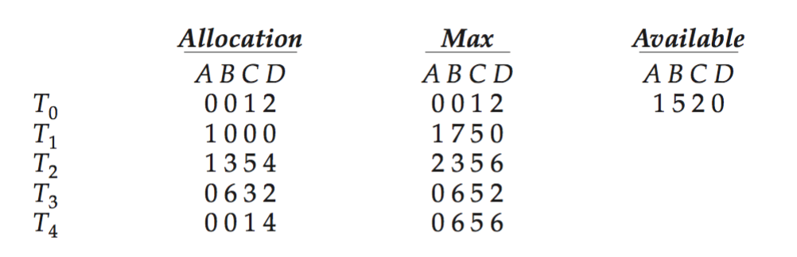
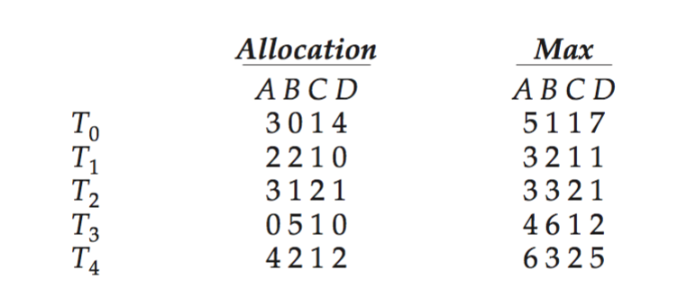
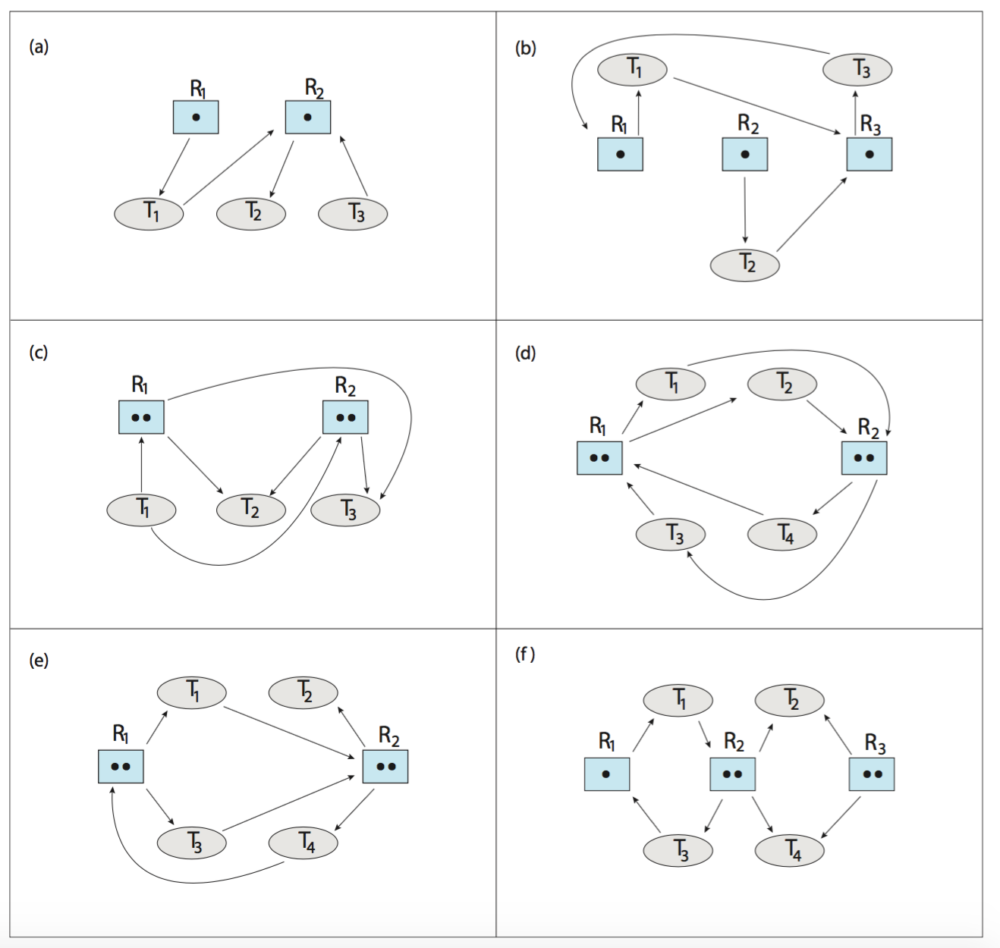
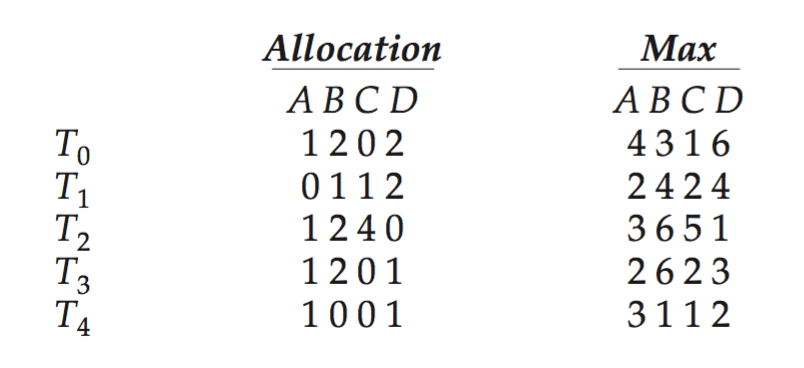

# Exercise Sheet for Tutorial 5

**Before** the tutorial session, try your best to solve problems below and be prepared to discuss them at the tutorial session.

### Related to Chapter 8
1. List three examples of deadlocks that are not related to a computer system environment.
2. Give an example of a system in an unsafe state (according to definition from lectures) where it is possible for the threads to complete their execution without entering a deadlocked state.
3. **(important)** Consider the following snapshot of a system:

    {: .img-fluid. max-width: 100%; }
    

    - Is the system in a safe state?
    - If a request from thread T1 arrives for (0,4,2,0), can the request be granted immediately?
4. A possible method for preventing deadlocks is to have a single, higher-order resource that must be requested before any other resource. For example, if multiple threads attempt to access the synchronization objects A, ..., E, a deadlock is possible. (Such synchronization objects may include mutexes, semaphores, condition variables, and the like.) We can prevent deadlock by adding a sixth object F. Whenever a thread wants to acquire the synchronization lock for any object A, ..., E, it must first acquire the lock for object F. This solution is known as containment: the locks for objects A, ..., E are contained within the lock for object F. Compare this scheme with the circular-wait scheme of Section 8.5.4.
5. Argue that the safety algorithm presented in Section 8.6.3 requires an O(m n²) operations.
6. Can a system detect that some of its threads are starving? If you answer "yes", explain how it can. If you answer "no", explain how the system can deal with the starvation problem.
7. Consider the following resource-allocation policy. Requests for and releases of resources are allowed at any time. If a request for resources cannot be satisfied because the resources are not available, then we check any threads that are blocked waiting for resources. If a blocked thread has the desired resources, then these resources are taken away from it and are given to the requesting thread. The vector of resources for which the blocked thread is waiting is increased to include the resources that were taken away. For example, a system has three resource types, and the vector Available is initialized to (4,2,2). If thread T0 asks for (2,2,1), it gets them. If T1 asks for (1,0,1), it gets them. Then, if T0 asks for (0,0,1), it is blocked (resource not available). If T2 now asks for (2,0,0), it gets the available one (1,0,0), as well as one that was allocated to T0 (since T0 is blocked). T0's allocation vector goes down to (1,2,1), and its Need vector goes up to (1,0,1).
    - Can deadlock occur? If you answer "yes", give an example. If you answer "no", specify which necessary condition cannot occur.
    - Can indefinite blocking occur? Explain your answer.
8. **(important)** Consider the following snapshot of a system:

    {: .img-fluid. max-width: 100%; }
    

    Using the banker's algorithm, determine whether or not each of the following states is unsafe. If the state is safe, illustrate the order in which the threads may complete. Otherwise, illustrate why the state is unsafe.
    - Available = (0, 3, 0, 1)
    - Available = (1, 0, 0, 2)
9. Suppose that you have coded the deadlock-avoidance safety algorithm that determines if a system is in a safe state or not, and now have been asked to implement the deadlock-detection algorithm. Can you do so by simply using the safety algorithm code and redefining max[i] = waiting[i], Allocationi, where Waitingi is a vector specifying the resources for which thread i is waiting and Allocationi is as defined in Section 8.6? Explain your answer.
10. **(important)** Is it possible to have a deadlock involving only one single-threaded process? Explain your answer.
11. Draw the resource-allocation graph that illustrates deadlock from the program example shown in Figure 8.1 in Section 8.2.
12. Assume that a multithreaded application uses only reader–writer locks for synchronization. Applying the four necessary conditions for deadlock, is deadlock still possible if multiple reader–writer locks are used?
13. The program example shown in Figure 8.1 of the book (2 mutex deadlock example) doesn’t always lead to deadlock. Describe what role the CPU scheduler plays and how it can contribute to deadlock in this program.
14. **(important)** Which of the six resource-allocation graphs shown in Figure below illustrate deadlock? For those situations that are deadlocked, provide the cycle of threads and resources. Where there is not a deadlock situation, illustrate the order in which the threads may complete execution.
15. **(important)** Which of the six resource-allocation graphs shown in Figure below illustrate deadlock? For those situations that are deadlocked, provide the cycle of threads and resources. Where there is not a deadlock situation, illustrate the order in which the threads may complete execution.

    {: .img-fluid. max-width: 100%; }
    

16. Consider the version of the dining-philosophers problem in which the chopsticks are placed at the center of the table and any two of them can be used by a philosopher. Assume that requests for chopsticks are made one at a time. Describe a simple rule for determining whether a particular request can be satisfied without causing deadlock given the current allocation of chopsticks to philosophers.
17. Consider the following snapshot of a system:

    {: .img-fluid. max-width: 100%; }
    

    Using the banker’s algorithm, determine whether or not each of the following states is unsafe. If the state is safe, illustrate the order in which the threads may complete. Otherwise, illustrate why the state is unsafe.
    - Available = (2, 2, 2, 3)
    - Available = (4, 4, 1, 1)
    - Available = (3, 0, 1, 4)
    - Available = (1, 5, 2, 2)
18. A single-lane bridge connects the two Vermont villages of North Tunbridge and South Tunbridge. Farmers in the two villages use this bridge to deliver their produce to the neighboring town. The bridge can become deadlocked if a northbound and a southbound farmer get on the bridge at the same time. (Vermont farmers are stubborn and are unable to back up.) Using semaphores and/or mutex locks, design an algorithm in pseudocode that prevents deadlock. Initially, do not be concerned about starvation (the situation in which northbound farmers prevent southbound farmers from using the bridge, or vice versa).

### In class
Discuss the exercises prepared at home
