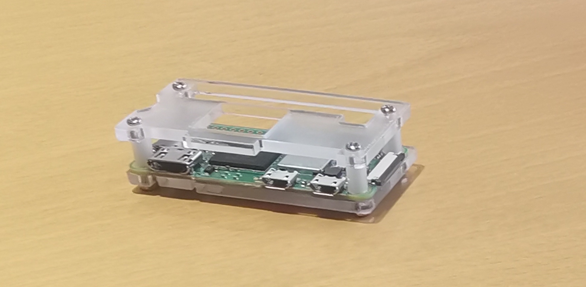

The purpose of these instructions is to assemble a Raspberry Pi Zero 2W, install and configure its operating system
so that you can access it via SSH (a remote terminal).

You should have:
- one Raspberry Pi Zero 2W
- A micro SD card and SD adapter
- a micro USB to USB cable
- a protection case

Please treat all hardware with great care so that future generations of students can enjoy them as well. 



# Preparation
Unpack the Pi and the case and put them together using the screws. Keep the plastic bag of the case so that you can later put the assembled Pi and the SD card (including adapter) inside it. The assembled Pi should look as follows:

{: width="300" }

In order to connect a computer via SSH to the Pi, both need to be in the same network. The easiest way is to have both be in the same wireless LAN (WIFI). Since Eduroam (the WIFI at the University) requires complicated authentification with a certificate, either use your home WIFI or create a hotspot with your mobile phone, which you can enter with both your computer and the Pi.

# Setting up the operating system
The Pi uses an SD card instead of a hard drive. The SD card is currently empty and you need to install a Linux operating system on it and configure it.
Fortunately, there is a tool that makes this very easy: On your regular computer download the [Raspberry Pi Imager tool](https://www.raspberrypi.com/software/), which is available for Linux, MacOS, and Windows. Please use a recent version. I (Lars) have tested it with version 2.0.6. 
Unpack and insert the micro SD card (possibly by plugging it into the SD adapter) into your computer. If your computer has no SD card slot and you have no adapter to use it with your computer, please find a fellow student who can help you with this. You only need to write to the SD card once.

Run the Imager tool.
- Under Raspberry Pi Device, choose `Raspberry Pi Zero 2W`
- Under OS, choose `Raspberry Pi OS (64-bit)`
- Under storage, choose the SD card
- Select a hostname, for example raspberry
- Select a username and password
- Configure your WIFI
- Select `Enable SSH` and `Use password authentification`

Press `Save` and then `Yes`. Confirm to erase the contents of the SD card.
The Imager tool is now writing to the SD card, which will take a while.

# Taking the Pi for a test run
Remove the SD card from your computer and insert it into the Pi. Plug the micro USB cable into one of the two sockets of the Pi and the other side into some power source, which can be a USB socket of your computer or a USB wall charger.
The LED on the Pi should turn on. It can take a minute or so for the Pi to boot and to connect to the WIFI you specified.

On your computer open an SSH client and connect to raspberry.local (or whatever name you choose in the configuration). Log in with the username and password you configured. On a Unix command line this would work as follows (assuming the username is pi):
```
ssh pi@raspberry.local
```
Accept the certificate if asked.
The approach above uses mDNS, a protocol that allows network devices to propagate their name locally. If this does not work, you can always connect to the Pi using its IP address. The only problem is finding its IP address. If you connect via a hotspot on your mobile phone, you can usually see the connected devices and their IP addresses.

Now you should have terminal access to the Pi. Try the following:
```
    cd /sys/class/leds/ACT
```
You are now in the directory corresponding to the onboard LED.
Change the permission of the LED's brightness so that any user can write to it:
```
    sudo chmod a+w brightness
```
Turn it off using
```
    echo 0 > brightness
```
Turn it on again using
```
    echo 1 > brightness
```
If this worked, congratulations, you have access to the Pi!

# Programming and working on the Pi
You can directly write programs on the Pi or you can write them on your computer and then copy them to the Pi.
For example, to copy files via SSH on a Unix machine, use `scp`. 
For the purpose of this course, I (Lars) recommend to compile programs on the Pi itself. Your computer most likely
has a different CPU architecture than the Pi (arm64). It requires a cross-compiler to compile a program that
can be run on a different CPU architecture, which is non-trivial to set up. There are many instructions on it online, but do this at your own risk.

For program and compile a Hello World program on the Pi itself via SSH,
use the following instructions.
Start by moving into the home directory:
```
    cd ~
```
Create a new folder for the project and navigate to it:
```
    mkdir helloworld
    cd helloworld
```
Create and open a file `main.c` with `nano`, a terminal-based text editor:
```
    nano main.c
```
Write the following:
```
    #include <stdio.h>

    int main()
    {
        printf("Hello DM510!\n");
        return 0;
    }
```
Save (Ctrl+O) and close (Ctrl+X) the file. Then compile it using:
```
    gcc -o main main.c
```
Run it using
```
    ./main
```
Alternatively you could use the text editor `vi`, which is much more powerful and convenient once you understand it, but takes time to learn.

# Serial connection over USB (optional)
The Raspberry Pi can be configured in such a way that a serial connection to a host computer
 is established over the USB cable. This gives you terminal access without requiring a network connection.
It can be very helpful, for example, to debug network problems, when the SSH connection fails.

The following requires modification of ext4 file system, which may not be straight-forward on Windows (although there are ways).
The following instructions require a **Linux host machine**.

Insert the SD card to your computer. The SD card should be mounted and have two file systems `bootfs` and `rootfs`.
 Open the file `.../bootfs/config.txt`.
Add the following line to the end:
```
dtoverlay=dwc2
```
Now open the file `.../bootfs/cmdline.txt`. After `rootwait` insert a space and:
```
modules-load=dwc2,g_serial
```
There should not be any line breaks. Before and after the text above there should be a single space.

In a terminal navigate to the directory `.../rootfs/etc/systemd/system/getty.target.wants/` (create it if it does not exist). Then in this directory create a symbolic link using the following.
```
ln -s /lib/systemd/system/getty@.service getty@ttyGS0.service
```
You might need superuser priviledges. In this case, run the command above with `sudo ln ...`.

Insert the USB cable into the **inner** micro USB socket of the Pi. Insert the other side to your computer's USB socket. Your computer should be able to see a new serial device. Find the name either by checking `dmesg` or by
typing
```
ls -l /dev/serial/by-id
```
It should show you the device id, for example, `/dev/ttyACM0`. 
Use any serial client to connect to it. On Windows for example, you can use PuTTY. On 
Linux, you can use `screen`, which on many distributions can be installed using `sudo apt install screen`.
Run
```
sudo screen /dev/ttyACM0
```
where might need to replace `ttyACM0` by the correct device.

# Network connection over USB (optional)
Instead of WIFI, it is also possible to make a network connection to the Pi via the USB cable.
This requires slightly more effort and may be more prone to errors. If you would like to try it, follow these
[instructions](https://www.raspberrypi.com/news/usb-gadget-mode-in-raspberry-pi-os-ssh-over-usb/).

I (Lars) have followed these instructions successfully himself, but experienced the following problem on Linux: the connection sometimes could not be established if the Pi has not finished booting at the time the USB cable is connected. I could fix this by first connecting the Pi to a power source using the outer micro USB socket and then only after the Pi has finished booting up, connect the other micro USB to the computer. This requires two micro USB cables. Make sure that the micro USB cable that connects the Pi to the computer is a data cable (for example the one that you got from the university). In contrast some USB cables are only for power.

