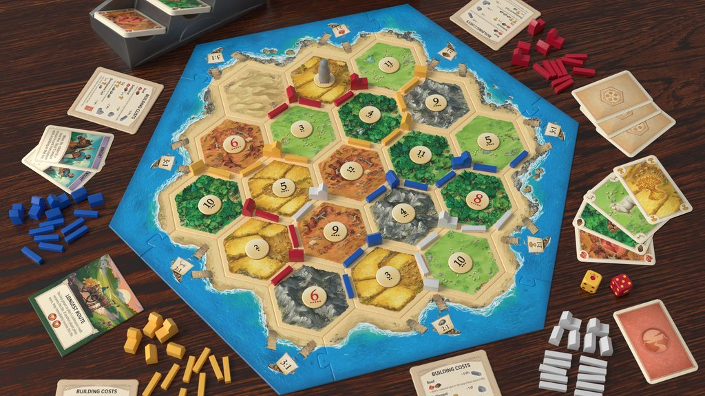

The actual board games are only inspiration for optimization problems. It is not the goal
of this course to develop algorithms for competitive games, but rather to solve interesting optimization
problems. 

### Pandemic

A disease broke out and several major cities are infected.
Every week you can send medical teams to cities (infected or not) and vaccinate/heal the population there.
The number of medical teams is limited.
Every week the disease also spreads to all neighboring cities of infected cities that have not been vaccinated/healed yet.  
Minimize the causalities, which you can formalize in different ways.

### Labyrinth

The map is a labyrinth with some locations having treasures. You are given a list of treasures
which you need to collect (in a specified order), starting at a certain position.
You can freely move in the labyrinth as far as you want, but some treasures might be unreachable.
To solve this, you can use magic spells to alter the labyrinth in some fixed ways. In the actual game
you can shift an entire row or column of the labyrinth, but it is a good idea to start with simpler
alternations. For example, you are given a collection of fields and ways you are allowed to
change this single field.
The goal is to collect all treasures with the minimal number of magic spells used.

### Ticket-to-Ride

On the map you see different major cities. You are given some pairs of cities that you should 
connect with a train network (e.g. Amsterdam to Copenhagen and Madrid to Marseille). Making a connection between two cities requires a certain number of resources of different kinds, marked in color on the map, sometimes direct connection between two cities may not be possible, but you could connect them indirectly. 
Sometimes one direct connection can be used for connecting two different pairs of cities.

For example, connecting Copenhagen with Cologne might cost 6 gray resources, connecting Copenhagen to Stockholm might cost 3 yellow and 3 white resources. Connecting Copenhagen directly to Amsterdam might not be possible, but Amsterdam-Cologne-Copenhagen may be.

Of each resource you only have a limited budget. How do you connect all pairs?

### Catan
The regions on the map (see below) correpond to different resources and for each settlement
next to it, you receive this resource at a specified rate (e.g. 3 units per round).
On the borders between regions
you can build roads, unless another player has already done so. At the intersection points you can build settlements (again, unless there is already one). In fact, you cannot build one settlement right next to the other (distance must be at least 2).
Assume that you and other players have already built some settlements and roads. Your goal
is to have a good supply of each resource, say, at least 10 units per round and resource.
Your initial roads and settlements might not all be connected,
but you are only allowed to build new roads next to
your existing roads or settlements. Similarly, you are only allowed to
build new settlements at your roads. The number of roads and settlements you can build
is limited.

### N.Y. Chase

The high profile criminal Mr. X was spotted an hour ago at a specific crossing in Manhattan.
There are different modes of transportation in Manhattan, for example, metro, ferry and taxi.
Mr. X has a limited number of tickets that he can use for each mode of transportation
and the FBI determined which tickets he already used in the past hour.
Install road blocks at specific crossings to make sure that
Mr. X cannot escape (leave Manhattan). However, the number of road blocks you can use is limited.

### Risk (maybe tricky)

The game map consists of different regions. Your enemy has placed their troops on some of the regions. 
You now want to occupy a set of regions and that you can also defend by placing your own troops on
strategically good regions. 

We assume that after your decision, the enemy will freely move their troops between adjacent regions and
try to attack you.
The enemy can gather troops on a region where you also have troops, which leads to a battle. When this happens, the number of troops of both you and the enemy reduces at the same rate until either you or the enemy has no troops left on this region (and the other one wins). If the enemy wins, they can move on from there.
 
You want to select a set of regions to occupy and place your troops on some regions (without enemy troops) such that no matter their sequence of moves, the enemy cannot capture any of your occupied regions.
Note that you cannot move your troops after the initial placement.
Each occupied region gives you a specific profit that you want to maximize.
In some variant, also fully occupied continents (Europe, Africa, etc.) give you a profit.

