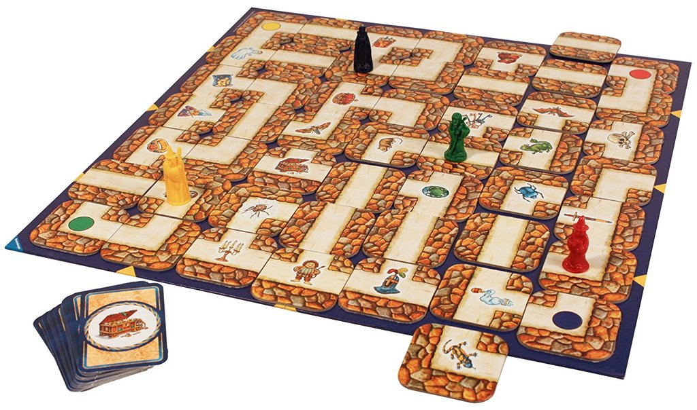

The following problems are inspired by the board games, but they do not resemble exactly the rules and
this is also not the goal.

### Pandemic

A disease broke out and several major cities are infected.
Every week you can send medical teams cities (infected or not) and vaccinate/heal the population there.
Then the disease spreads to all neighboring cities of infected cities that have not been vaccinated yet.  
Minimize the number of weeks until the entire world has been vaccinated.

### Labyrinth

The map is a labyrinth with some locations having treasures. You are given a list of treasures
which you need to collect (in a specified order), starting at a certain position.
You can move freely move in the labyrinth as far as you want, but some treasures might be unreachable.
To solve this, you can use magic spells to alter the labyrinth in some fixed ways. In the game
you can move an entire row or column of the labyrinth, but you are free to look at other, simpler alternations as well.
The goal is to collect all treasures with the minimal number of magic spells used.

### Ticket-to-Ride

The map consists of different cities. You are given some pairs of cities that you should pairwise
connect with a train network (e.g. Amsterdam to Copenhagen and Madrid to Marseille). Making a connection between two cities requires a certain number of resources of different kinds, marked in color on the map, sometimes
direct connection may not be possible, but you could connect them also indirectly. 

For example, connecting Copenhagen with Cologne might cost 3 gray resources, connecting Copenhagen to Stockholm might cost 3 yellow and 3 white resources. Connecting Copenhagen directly to Amsterdam might not be possible, but Amsterdam-Cologne-Copenhagen may be.

Of each resource you only have a limited budget. How do you connect all pairs?

### N.Y. Chase

The high profile criminal Mr. X was spotted an hour ago at a specific crossing in Manhattan.
There are different modes of transportation in Manhattan, for example, metro, ferry and taxi.
You know, which modes of transportation Mr. X used and how often he did. This can be used to
estimate his current position. Install road blocks at specific locations to make sure
Mr. X cannot escape. However, the number of road blocks you can use is limited.
To reduce the police search, you want to minimize the positions where Mr. X can still travel to.

### Risk

The game map consists of different regions. Your enemy has placed their troops on some of the regions. 
You now want to occupy a set of regions and that you can also defend by placing your own troops on
strategically good regions. 

We assume that after your decision, the enemy will freely move their troops between adjacent regions and
try to attack you.
The enemy can gather troops on a region where you also have troops, which leads to a battle. When this happens, the number of troops of both you and the enemy reduces at the same rate until either you or the enemy has no troops left on this region (and the other one wins). If the enemy wins, they can move on from there.
 
You want to select a set of regions to occupy and place your troops on some regions (without enemy troops) such that no matter their sequence of moves, the enemy cannot capture any of your occupied regions.
Note that you cannot move your troops after the initial placement.
Each occupied region gives you a specific profit that you want to maximize.
In some variant, also fully occupied continents (Europe, Africa, etc.) give you a profit.

